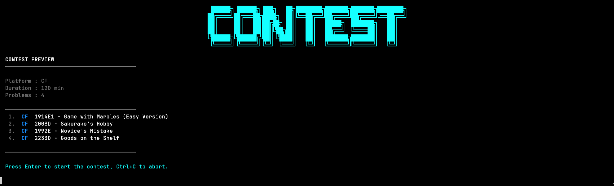
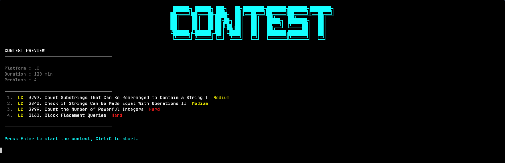
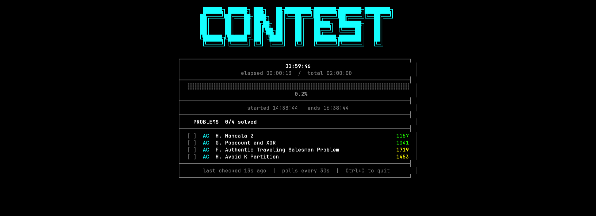

# candidate

A CLI tool for competitive programmers to run timed virtual contests using problems from **Codeforces**, **AtCoder**, and **LeetCode**. Problems are pulled from your unsolved pool and tracked in real time as you submit. 










---

## Features

- Virtual contests on Codeforces, AtCoder, LeetCode, or a mixed set
- **Tier-based problem selection**: 50% of problems are drawn from tier 1 (easier) and 50% from tier 2 (harder)
- Real-time solve tracking: the tool polls each platform and marks problems solved as you submit; the contest ends automatically when everything is accepted
- **Auto detection of session cookies**: no manual copying needed; the tool reads your browser's stored session for AtCoder and LeetCode (Chrome, Brave, Firefox, Safari, Edge, and Opera are supported)
- **Tag filtering**: narrow the problem pool to specific topics like `dp` or `graphs`. Not available in mixed (`x`) mode yet
- Configurable difficulty ranges, recency filters, and display options via `config.toml`

---

## Requirements

- Python 3.11+
- For **LeetCode** and **AtCoder**: An account on the platform and at least one supported browser installed and logged in.
- For **Codeforces**: Only your handle is needed.

---

## Installation

### Recommended: pipx

pipx installs CLI tools in isolated environments and puts them on your PATH automatically.

**Install pipx if you don't have it:**

```bash
# Linux/macOS
pip install --user pipx
pipx ensurepath

# Arch Linux
sudo pacman -S python-pipx

# macOS (Homebrew)
brew install pipx
```

**If you don't have pip:**

```bash
# Linux/macOS
python3 -m ensurepip --upgrade

# Ubuntu/Debian
sudo apt install python3-pip

# Arch Linux
sudo pacman -S python-pip

# macOS (Homebrew)
brew install python
```

**Then install candidate:**

```bash
pipx install candidate
```

To update later:

```bash
pipx upgrade candidate
```

---

### Alternative: pip

```bash
pip install --user candidate
```

To update:

```bash
pip install --upgrade candidate
```

---

## First Run

Run the tool once to generate a default config:

```bash
candidate
```

On first launch, if no config is found, it will be created at `~/.config/candidate/config.toml`. Open it and fill in your handles. Then run `candidate` again.

---

## Configuration

config file at `~/.config/candidate/config.toml` looks like this:

```toml
# don't leave handles empty

[handles]
codeforces = "your_cf_handle"
atcoder    = "your_ac_handle"
leetcode   = "your_lc_handle"

[codeforces]
tier1      = [1000, 1500] # rating range for easier problems
tier2      = [1600, 1900] # rating range for harder problems
recent_max = 1900 # only include problems from contests >= this number

[atcoder]
tier1      = [1000, 1200]
tier2      = [1300, 1800]
recent_max = 320 # only include ABC/ARC/AGC contests >= this number

[leetcode]
difficulties = ["MEDIUM", "HARD"] # valid values: "EASY", "MEDIUM", "HARD"
recent_max   = 2500 # only include problems with ID >= this number

[display]
show_difficulties = false # show difficulty label next to each problem title
```

If some fields are omitted, these defaults apply:

| Key | Default |
|-----|---------|
| handles.codeforces | "" |
| handles.atcoder | "" |
| handles.leetcode | "" |
| codeforces.tier1 | [1000, 1500] |
| codeforces.tier2 | [1600, 1900] |
| codeforces.recent_max | 1900 |
| atcoder.tier1 | [1000, 1200] |
| atcoder.tier2 | [1300, 1800] |
| atcoder.recent_max | 320 |
| leetcode.difficulties | ["MEDIUM", "HARD"] |
| leetcode.recent_max | 2500 |
| display.show_difficulties | false |

You probably don't want to leave all handles empty, enter at least one.

### What each setting does

**[handles]**: Your usernames on each platform. Used to filter out problems you have already solved and to verify submissions during a contest.

**[codeforces]**
- `tier1` / `tier2`: Rating ranges for the two difficulty buckets. The sampler draws 50% of problems from each tier.
- `recent_max`: Only includes problems from contests with an ID at or above this value.

**[atcoder]**
- `tier1` / `tier2`: Same as Codeforces but uses AtCoder's internal difficulty score.
- `recent_max`: Only includes problems from ABC/ARC/AGC contests numbered at or above this value.

**[leetcode]**
- `difficulties`: Which difficulty levels to draw from. 
- `recent_max`: Only includes problems with a frontend ID at or above this value.

**[display]**
- `show_difficulties`: When set to `true`, each problem in the contest view shows its difficulty label next to the title. Note that this is off by default.

---

## Usage

Just run the tool and follow the interactive prompt:

```bash
candidate
```

| Prompt             | Description                                             |
| ------------------ | ------------------------------------------------------- |
| Platform           | cf (Codeforces), ac (AtCoder), lc (LeetCode), x (mixed) |
| Time limit         | Contest duration in minutes                             |
| Number of problems | How many problems to include                            |
| Tags               | Optional comma-separated filters                        |

After setup, a preview of the selected problems is shown. Press **Enter** to start or **Ctrl+C** to abort.

During the contest:
- The timer and solve status update every second
- Submissions are polled every 30 seconds
- The contest ends automatically when all problems are solved or time runs out
- Press **Ctrl+C** at any time to quit early, results are shown regardless

---

## Session Cookies

AtCoder and LeetCode require an active login session to fetch solved problems and verify submissions. As long as you are logged in on either platform in a supported browser, candidate detects and caches your session automatically on first run.

If auto-detection fails, you can set cookies manually in `~/.config/candidate/.env`:

```
LC_SESSION_COOKIE=your_leetcode_session_here
AC_SESSION_COOKIE=your_atcoder_session_here
```

Supported browsers: Chrome, Brave, Firefox, Safari, Edge, Opera